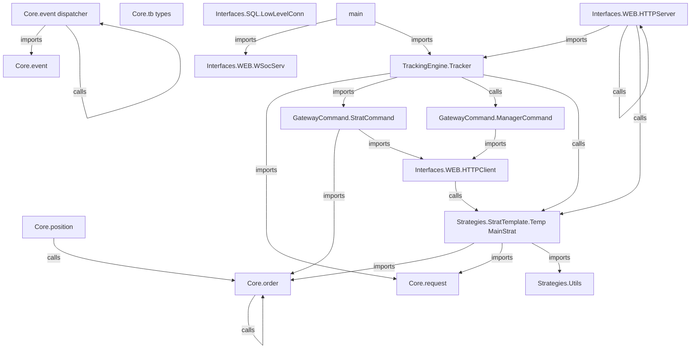

# Codebase Dependency Graph

## Visual Graph

## Detailed Dependencies

### Core.event
**Path:** `/home/lenovo/Desktop/StratConn/SRC/Core/event.py`

**Imports:**
  - `dataclasses`
  - `datetime`
  - `tb_types`
  - `typing`

**Classes Defined:**
  - `Event`

### Core.event_dispatcher
**Path:** `/home/lenovo/Desktop/StratConn/SRC/Core/event_dispatcher.py`

**Imports:**
  - `dataclasses`
  - `datetime`
  - `event`
  - `functools`
  - `tb_types`
  - `typing`
  - `zoneinfo`

**Classes Defined:**
  - `EventDispatcher`

**Methods Defined:**
  - `EventDispatcher.__init__`
  - `EventDispatcher.add_listeners`
  - `EventDispatcher.dispatch`
  - `decorator`
  - `dispatch_event`
  - `wrapper`

**Methods Called:**
  - `Event`
  - `append`
  - `callback`
  - `datetime.datetime.fromtimestamp`
  - `event_dispatcher.dispatch`
  - `func`
  - `getattr`
  - `wraps`

### Core.order
**Path:** `/home/lenovo/Desktop/StratConn/SRC/Core/order.py`

**Imports:**
  - `dataclasses`
  - `tb_types`
  - `typing`

**Classes Defined:**
  - `Order`

**Methods Defined:**
  - `Order.asdict`
  - `Order.set`

**Methods Called:**
  - `AttributeError`
  - `asdict`
  - `hasattr`
  - `kwargs.items`
  - `setattr`

### Core.position
**Path:** `/home/lenovo/Desktop/StratConn/SRC/Core/position.py`

**Imports:**
  - `dataclasses`
  - `tb_types`
  - `typing`

**Classes Defined:**
  - `Position`

**Methods Defined:**
  - `Position.asdict`
  - `Position.set`

**Methods Called:**
  - `AttributeError`
  - `asdict`
  - `hasattr`
  - `kwargs.items`
  - `setattr`

### Core.request
**Path:** `/home/lenovo/Desktop/StratConn/SRC/Core/request.py`

**Imports:**
  - `enum`

**Classes Defined:**
  - `REQUEST`

**Methods Called:**
  - `auto`

### Core.tb_types
**Path:** `/home/lenovo/Desktop/StratConn/SRC/Core/tb_types.py`

**Imports:**
  - `enum`

**Classes Defined:**
  - `Asset`
  - `EventType`
  - `OrderStatus`
  - `OrderType`
  - `PositionStatus`
  - `Side`

**Methods Called:**
  - `auto`

### GatewayCommand.ManagerCommand
**Path:** `/home/lenovo/Desktop/StratConn/SRC/GatewayCommand/ManagerCommand.py`

**Imports:**
  - `Interfaces.WEB.HTTPClient`

**Classes Defined:**
  - `GateComm`

**Methods Defined:**
  - `GateComm.__init__`
  - `GateComm.get_price`
  - `GateComm.start_simulation`

**Methods Called:**
  - `BasicClient`
  - `self.sender.send_request`

### GatewayCommand.StratCommand
**Path:** `/home/lenovo/Desktop/StratConn/SRC/GatewayCommand/StratCommand.py`

**Imports:**
  - `Core.order`
  - `Interfaces.WEB.HTTPClient`

**Classes Defined:**
  - `GateComm`

**Methods Defined:**
  - `GateComm.__init__`
  - `GateComm.cancel_order`
  - `GateComm.close_position`
  - `GateComm.submit_order`

**Methods Called:**
  - `BasicClient`
  - `self.sender.send_request`

### Interfaces.SQL.LowLevelConn
**Path:** `/home/lenovo/Desktop/StratConn/SRC/Interfaces/SQL/LowLevelConn.py`

### Interfaces.WEB.HTTPClient
**Path:** `/home/lenovo/Desktop/StratConn/SRC/Interfaces/WEB/HTTPClient.py`

**Imports:**
  - `json`
  - `urllib.request`

**Classes Defined:**
  - `BasicClient`

**Methods Defined:**
  - `BasicClient.__init__`
  - `BasicClient.send_request`

**Methods Called:**
  - `Request`
  - `decode`
  - `encode`
  - `json.dumps`
  - `json.loads`
  - `response.read`
  - `str`
  - `urlopen`

### Interfaces.WEB.HTTPServer
**Path:** `/home/lenovo/Desktop/StratConn/SRC/Interfaces/WEB/HTTPServer.py`

**Imports:**
  - `TrackingEngine.Tracker`
  - `http.server`
  - `json`

**Classes Defined:**
  - `MyHandler`

**Methods Defined:**
  - `MyHandler._send_json`
  - `MyHandler.do_OPTIONS`
  - `MyHandler.do_POST`
  - `run`

**Methods Called:**
  - `GenTrack`
  - `body.decode`
  - `encode`
  - `httpd.serve_forever`
  - `int`
  - `json.dumps`
  - `json.loads`
  - `len`
  - `my_infos.get`
  - `run`
  - `self.Sub_handler`
  - `self._send_json`
  - `self.end_headers`
  - `self.headers.get`
  - `self.rfile.read`
  - `self.send_error`
  - `self.send_header`
  - `self.send_response`
  - `self.wfile.write`
  - `server_class`
  - `str`

### Interfaces.WEB.WSocServ
**Path:** `/home/lenovo/Desktop/StratConn/SRC/Interfaces/WEB/WSocServ.py`

**Imports:**
  - `socket`
  - `threading`

**Classes Defined:**
  - `WebSocketServer`

**Methods Defined:**
  - `WebSocketServer.__init__`
  - `WebSocketServer._run_simulation`
  - `WebSocketServer.start_simulation`

**Methods Called:**
  - `conn.recv`
  - `conn.sendall`
  - `print`
  - `self._thread.start`
  - `sock.accept`
  - `sock.bind`
  - `sock.listen`
  - `socket.socket`
  - `threading.Lock`
  - `threading.Thread`

### Strategies.StratTemplate.Temp_MainStrat
**Path:** `/home/lenovo/Desktop/StratConn/SRC/Strategies/StratTemplate/Temp_MainStrat.py`

**Imports:**
  - `Core.order`
  - `Core.request`
  - `Core.tb_types`
  - `Utils`
  - `random`

**Classes Defined:**
  - `strategie`

**Methods Defined:**
  - `strategie.ProcessEvent`
  - `strategie.ProcessPrice`
  - `strategie.__init__`

**Methods Called:**
  - `GetOrderById`
  - `Order`
  - `randint`

### Strategies.Utils
**Path:** `/home/lenovo/Desktop/StratConn/SRC/Strategies/Utils.py`

**Methods Defined:**
  - `GetOrderById`

### TrackingEngine.Tracker
**Path:** `/home/lenovo/Desktop/StratConn/SRC/TrackingEngine/Tracker.py`

**Imports:**
  - `Core.request`
  - `Core.tb_types`
  - `GatewayCommand.StratCommand`
  - `Strategies.StratTemplate.Temp_MainStrat`
  - `datetime`
  - `importlib`

**Classes Defined:**
  - `GenTrack`

**Methods Defined:**
  - `GenTrack.SendEvent`
  - `GenTrack.UpdatePrice`
  - `GenTrack.__init__`

**Methods Called:**
  - `GateComm`
  - `datetime.datetime.now`
  - `importlib.import_module`
  - `self.CurStrat.ProcessEvent`
  - `self.CurStrat.ProcessPrice`
  - `self.Current_Orders.append`
  - `self.GateComm.submit_order`
  - `strategie`
  - `strategie_mod.strategie`

### main
**Path:** `/home/lenovo/Desktop/StratConn/SRC/main.py`

**Imports:**
  - `Interfaces.WEB`
  - `TrackingEngine`

**Methods Called:**
  - `HTTPServer.run`

